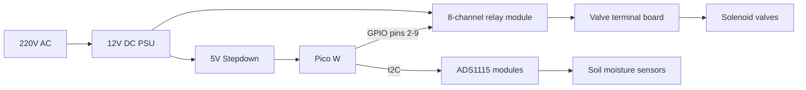
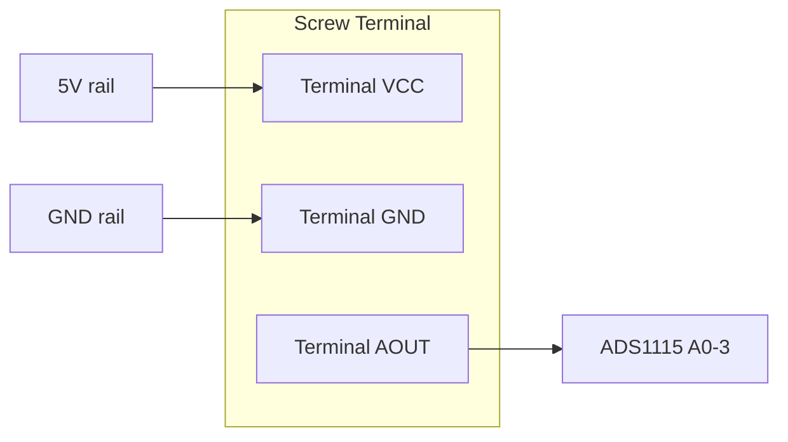
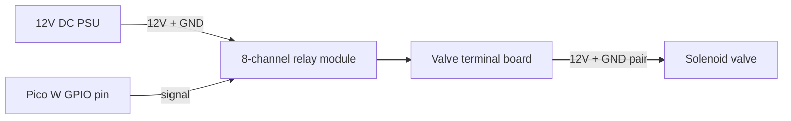

# Assembly

The assembly steps contain checks to verify things are working as expected. However they do not include instructions for how to solve these, because there could be a lot of different reasons, e.g. faulty modules, incorrect wiring, bad solder joints, etc.

## System overview



## The perfboard

### Power supply

1. Solder a 2-point screw terminal onto the board to connect to the 220V AC -> 12V DC converter's 12V end
2. Solder the 12V -> 5V USB stepdown converter to the board, and connect to the terminal
3. Plug into to mains and check you see the expected 12V and 5V (on the USB side)
4. Solder the PICO header rails onto the board
5. Create 2 power rails on the long sides of the board
6. Create a connection between the PICO's VBUS (5V out) (pin 40) and the power rail using a jump wire
7. Do the same between the GND rail and a PICO GND pin (i.e. pin 23)
8. Attach a PICO and connect to the mains. Check you see 5V between the power rail and the GND rail.

From this point onwards you can unplug everything from the mains, and disconnect the PICO from the stepdown converter. The power supply is working correctly, and going forward we'll need to test various modules using code, so we will connect the PICO to a development machine (computer) via USB instead.

### Analog signal readings

To improve reading accuracy we use 2 external ADS1115 modules to read the sensor values. Some 0.1μF ceramic capacitors are also added. When adding these it is easiest to simply colocate them with the jump cable ends, this fits, is space-efficient and saves you having to drag-solder an extra connection.

1. Solder the level shifter onto the board, and establish connections to the PICO and power rail
    1. HV to the 5V power rail
    2. LV to the PICO's 3V3 (OUT) (pin 36)
    3. GND on both sides to the GND rail
    4. LV1 to the PICO's SDA (pin 1)
    5. LV2 to the PICO's SCL (pin 2)
    6. Add a capacitor on the HV side, between HV and its GND
    7. Add a capacitor on the LV side, between LV and its GND
2. Solder the 2 ADS1115 modules onto the board. For the first one, ensure you leave at least 2 free holes for daisy chaining.
3. Now connect ADS1115-1 and ADS1115-2 to the rails, the level shifter, and each other
    1. Both VDD's to the power rail
    2. Both GND's to the GND rail
    3. ADS1115-1 ADDR to the GND rail
    4. ADS1115-2 ADDR to the 5V rail
    3. ADS1115-1 SCL to HV2 *
    4. ADS1115-1 SDA to HV1 *
    5. ADS1115-1 SCL to ADS1115-2 SCL
    5. ADS1115-1 SDA to ADS1115-2 SDA
4. For each ADS1115, add a capacitor between VDD and ground

**[*] NOTE THAT IN 3 & 4 THE PINS ARE ACTUALLY IN REVERSE ORDER ON THE ADS1115 COMPARED TO THE LEVEL SHIFTER**

To test this setup, you can run the following script on the PICO. If you see a device `0x48` and `0x49` being printed then you can proceed.

```python
from machine import I2C, Pin
import time

i2c = I2C(0, scl=Pin(1), sda=Pin(0), freq=400000)

while True:
    print("Scanning I2C bus...")
    devices = i2c.scan()

    if devices:
        for device in devices:
            print("Found device at address: ", hex(device))
    else:
        print("No I2C devices found!")

    time.sleep(2)
```

### Sensor terminals

Each sensor connects to the board via a 3-pin screw terminal (VCC, GND, AOUT). The sensors are capacitive soil moisture sensors which are powered permanently from the 5V rail. Capacitive sensors do not suffer from corrosion because their sensing element is an insulated copper trace — no bare metal is exposed to the soil.



For each sensor terminal:

1. Solder the 3-pin screw terminal to the perfboard, with the screws facing the GND or 5V rails
2. Connect the terminal VCC pin to the 5V power rail
3. Connect the terminal GND pin to the GND rail
4. Connect the terminal AOUT pin to one of the ADS1115's A0-3 input pins via a jump wire

To test, connect a sensor to a terminal and run `src/hardware_tests/sensor_test.py`. The ADS1115 channel corresponding to that terminal should show a voltage (typically 2-3V for a dry sensor, dropping to ~1V when submerged in water). All other channels should read ~4.5V (floating high).

### Valve relays

The system uses an 8-channel relay module to control solenoid valves. The relay module is powered directly from the 12V DC PSU (not from the perfboard). The only connection between the Pico and the relay module is the GPIO signal pins.

A separate small perfboard with 16 screw terminals serves as the terminal board for valve connections. Each valve connects to one pair of terminals (12V and GND).



1. Connect the relay module's VCC and GND (input side) to the 12V DC PSU
2. Connect each relay IN pin to its corresponding Pico GPIO pin (see table below)
3. Wire the relay output side through to the valve terminal board: 12V from the PSU powers one set of terminals, GND is routed through the relay's COM/NO contacts to the other set
4. For each solenoid valve, connect its two wires to one pair of terminals on the terminal board

| Terminal | GPIO Pin |
|----------|----------|
| Left-1   | 9        |
| Left-2   | 8        |
| Left-3   | 7        |
| Left-4   | 6        |
| Right-1  | 2        |
| Right-2  | 3        |
| Right-3  | 4        |
| Right-4  | 5        |

To test, run `src/hardware_tests/valve_test.py`. The script cycles through each relay channel with a 40-second pause, so you can verify which terminal activates for each GPIO pin. Use this to populate the mapping table in your `config.json`.
